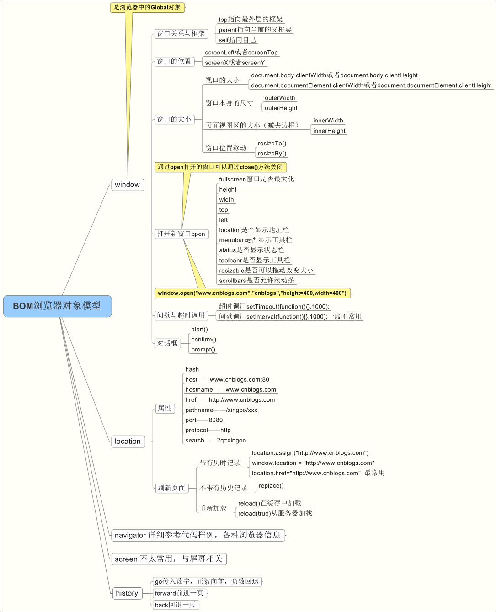

### js BOM

Bom：浏览器对象模型（Browser Object Model，简称 BOM）提供了独立于内容而与浏览器窗口进行交互的对象。描述了与浏览器进行交互的方法和接口，可以对浏览器窗口进行访问和操作

以下是DOM的图



其实还应该有 DOM ,不过 DOM 是我们 js 的重点.我们需要用另外的一节来学习

#### 1. window 对象

##### 方法:

* window.open('http://baidu.com'); // 在新窗口打开百度
* window.location = 'http://baidu.com'; // 让该页面跳转到百度
* window.alert('wysl') // 弹出框
* window.confirm('xswl') // 确认框
* window.setInterval() // 设置计时器
* window.clearInterval() // 清除给定计时器

``` javascripetInterval(()=>{

  }, 1000);
  window.clearIntet
  var a = window.srval(a);
```
##### 属性:

* window.innerHeight 页面的高度
* window.innerWidth 页面的宽度

##### 2. history

* history.back() === window.history.go(-1); // 返回到前一页
* history.go(-2); // 返回到前两页

##### 3.screen

* screen.availHeight // 屏幕实际高度
* screen.availWidth // 屏幕实际宽度
* screen.height // 屏幕高度
* screen.width // 屏幕宽度

明天继续