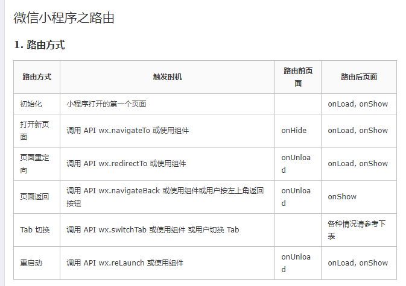

### 路由也是小程序重要的一环
#### 下面是路由的方式:


navigateTo, redirectTo 只能打开非 tabBar 页面。(可以使用路由传参)

switchTab 只能打开 tabBar 页面。(不可以使用路由传参)

reLaunch可以打开任意页面, 但是没有返回按钮，需要定义一个可以点击回退的按钮。

页面底部的 tabBar 由页面决定，即只要是定义为 tabBar 的页面，底部都有 tabBar。

调用页面路由带的参数可以在目标页面的onLoad中获取。

#### 小程序的路由参数

``` javascript
  wx.navigateTo({
    url: "/pages/coach/coachMessage/coachMessage?id=" + this.properties.coachCardData.id
  })
  // 采用拼接字符串的方法添加参数
  // 在跳转的页面中,在 onload 的生命周期中接收
  onLoad: function (options) {
    console.log(options.id)
  },

  wx.switchTab(){} 不支持路由传参

  // option 是 所有传入参数的集合
```